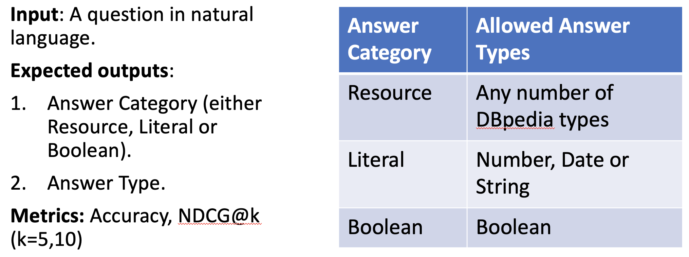

# Answer Type Prediction
This repository has code for an answer type prediction system. The system was developed for the SMART 2021 **DBpedia** answer type prediction challenge (https://smart-task.github.io/2021/). 

## Task Specification



### Examples


## System Description

### Type Embeddings


### Model


## Performance
The table below summarizes the performance of both our models.


## Running the Code
This repo has the source code for data processing, training and inference. Other resources like the training data, ontology, type embeddings, a presentation and a paper describing the system are present in the box folder. TODO: "provide a link to the box folder".

### Environment Setup
Create a new conda environment from the given `atp_env.yml`
```commandline
conda env create -f atp_env.yml
```

### Training
```commandline
mkdir ./model

cd ./code
 
python train_biencoder_with_types.py --data_parallel --lowercase --training_set_path ./train_completed_labels.json --val_set_path ./val.json --output_path ./model --tb --train_batch_size 8 --eval_batch_size 8 --learning_rate 3e-5 --type_network_learning_rate 3e-5 --num_train_epochs 6 --print_interval 500 --save_interval 500 --shuffle True --type_model 1 --num_types 791 --type_embeddings_path ./791_types.t7 --ontology_file ./dbpedia_ontology_node_to_parent.json --no_linear_after_type_embeddings --category_loss_weight 1.0 --type_loss_weight 1.0 --main_metric ndcg_5 --type_id_to_name_file ./type_id_to_name.json --smart_type_hierarchy_tsv ./smart_dbpedia_types_with_location.tsv --rep_for_ans_cat_pred unused --eval_set_paths ./val.json --eval_set_paths ./train_completed_labels.json
```

After training, the prediction and performance on the given ``eval_set_paths`` are written to ``./model``.

### Answer Type Prediction API
`./code/answer_type_prediction_api.py` provides an API to run inference with a pre-trained model. The main block of `./code/answer_type_prediction_api.py` demonstrates how the API should be used. The users can get a feel for the system by running it in an interactive mode as follows:

```commandline
cd ./code

python answer_type_prediction_api.py --output_directory ./temp --model_dir ./model --type_embeddings_path ./791_types.t7 --ontology_file ./dbpedia_ontology_node_to_parent.json --batch_size 2 --id_to_type_mapping_file ./type_id_to_name.json

```
